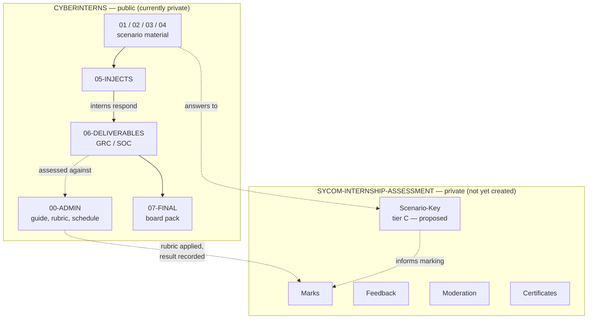
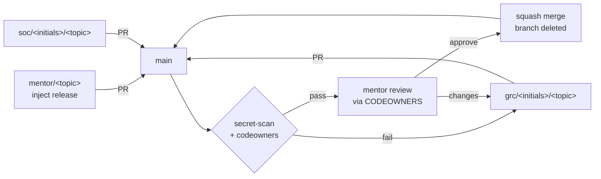

# Programme Architecture — Project Sentinel

Draft. Owner: CISO. Audience: CISO and mentors. Interns may read it.

How the pilot is assembled: what lives where, who can change it, what actually
enforces that, and where the parts are still missing.

[`REPO-GOVERNANCE.md`](REPO-GOVERNANCE.md) states the permission design and the
reasoning behind it. This document describes the system as a whole — content
tiers, delivery flow, the control plane and its current gaps — and is the place
to look for *what state are we actually in*.

---

## 1. Three tiers of sensitivity, not two

The governance design splits content on one axis: **criteria public, results
private**. That axis is correct and it is not sufficient. There is a third
category it does not name.

| Tier | Examples | Who may read | Home |
|---|---|---|---|
| **A — Open** | Scenario material, rubric, marking scheme, mentor guide, intern deliverables, board pack | Everyone, once public | `CYBERINTERNS` |
| **B — Personal** | Marks, written feedback, moderation notes, certificates | CISO + mentors | `SYCOM-INTERNSHIP-ASSESSMENT` |
| **C — Mentor-only scenario** | Planted-weakness key, inject solutions, per-inject marking guidance, the "what good looks like" answers | Mentors only, **not interns** | `SYCOM-INTERNSHIP-ASSESSMENT` |

Tier C is the one the two-repo split was not designed for. It is not personal
data, so nothing in the current governance sends it to the private repo — but
`00-ADMIN/` is readable by interns, so it cannot live here either. Publishing
the architecture answer key alongside the architecture would end the exercise.

**Decision recorded:** tier C goes in the private repo, in a `Scenario-Key/`
directory, on the basis of *who may read it* rather than *is it personal data*.
The private repo therefore holds two unrelated things and its README should say
so.

**Consequence:** no answer key currently exists. `02-ARCHITECTURE/` was written
with weaknesses planted and deliberately unlabelled; until tier C is written,
mentors have to find them the same way interns do.

## 2. Repository topology

The arrow that must never exist is `MARKS --> PUB`. That is what the split is
for, and `07-FINAL/README.md` states it at the point of temptation.

## 3. Identity and permissions

Target state from the governance document, against what exists today:

| Team | Intended role | Exists | Members | Repo access |
|---|---|---|---|---|
| `ciso` | Admin | Yes | 1 | **None granted** |
| `mentors` | Maintain | Yes | 1 | Write |
| `interns-grc` | Write | **No** | — | — |
| `interns-soc` | Write | **No** | — | — |
| `observers` | Read | **No** | — | — |

Two discrepancies worth a decision rather than a drift:

- `mentors` holds **Write**, the governance document specifies **Maintain**.
  Write is sufficient to merge and to satisfy the code-owner requirement.
  Maintain additionally allows branch and settings management short of
  destructive actions. Either is defensible; pick one and make the document
  match reality.
- `ciso` has no access to any repository. Harmless while the private repo does
  not exist, and a day-one problem the moment it does — its CODEOWNERS routes
  to `@sycom-academy/ciso`, and a team without write access does not resolve as
  a code owner. This is the identical failure that left this repository's
  CODEOWNERS non-functional from its first commit until today.

## 4. Control plane — what actually enforces what

| Intent | Mechanism | State |
|---|---|---|
| No direct pushes to `main` | `main-protection` ruleset | **Not imported** — unavailable while private on the free plan |
| A mentor reviews every change | CODEOWNERS + require code owner review | CODEOWNERS **resolves**; the requirement is not active until the ruleset imports |
| Secrets never land in history | `secret-scan` workflow (gitleaks 8.18.4) | **Running, green** on every commit |
| CODEOWNERS cannot silently break | `codeowners` workflow | **Running, green** |
| Those two checks block a merge | `required_status_checks` in the ruleset | **Not enforced** — ruleset not imported |
| Assessment paths untouchable | Not applicable — records are in another repository | Structural |
| Interns stay in their own directories | Convention + review | Social, never enforced |

Read that table as: **two detective controls are live, no preventive control
is.** Anyone with write access can push straight to `main` today.

### 4.1 The import deadlock, and the way round it

`main-protection.json` requires one approving review, code-owner review and
last-push approval, with `bypass_actors` empty. `mentors` has one member.
GitHub does not permit self-approval, so importing that ruleset as written
makes every PR authored by the sole mentor unmergeable — with no bypass.

Making CODEOWNERS resolve is what arms this. Before it resolved, the code-owner
requirement silently no-opped; now it would bite.

**The deadlock is not a GitHub limitation. It is a consequence of one design
choice**, made in `REPO-GOVERNANCE.md`: interns are given **Write** on this
repository, and the thing stopping them merging their own work is the approval
requirement. An approval requires a second human. So the whole control model
rests on a person who does not exist.

#### The fork model

Take the write access away and "cannot merge" stops being a rule that needs
enforcing and becomes a fact about access:

| | Write model (as designed) | Fork model |
|---|---|---|
| Intern repo access | Write | **None** — public read only |
| Intern works on | a branch in this repo | a branch in their own fork |
| Opens PR | from this repo | from their fork |
| Can merge own PR? | Only prevented by approval count | **Cannot. No write access** |
| Needs a second mentor to be safe? | **Yes** | **No** |
| Contribution evidence | PR authorship and review threads | Identical |

This is how every open-source project on GitHub operates, it costs nothing,
and it removes the second-mentor dependency from the control model entirely.

Two real costs, stated rather than glossed:

- **Git complexity.** Interns must fork, add an upstream remote, and keep their
  fork in sync. For people new to git that is a genuine additional thing to
  learn in week 1, and it will produce support questions.
- **It needs the repository to be public.** Forking a private repository is
  possible but messy. This is not a new dependency — going public is already
  required for rulesets at all.

#### `main-protection-solo.json`

Import this **instead of** `main-protection.json` while `mentors` has one
member. Differences, and nothing else changes:

| Parameter | Full | Solo |
|---|---|---|
| `required_approving_review_count` | 1 | **0** |
| `require_code_owner_review` | true | **false** |
| `require_last_push_approval` | true | **false** |
| `dismiss_stale_reviews_on_push` | true | **false** |

Everything else is identical. With one mentor it still enforces: no direct
push to `main`, both CI checks green before merge, branch up to date with
`main`, linear history, squash-only, no force-push, no deletion, and all review
threads resolved.

What it gives up is an approving review by a second human — which cannot be
obtained with one mentor under any configuration, so it is not a trade so much
as an acknowledgement.

**It is only safe alongside the fork model.** With interns holding Write and
zero required approvals, an intern could merge their own deliverable
unreviewed. If you keep Write access, do not import the solo ruleset.

**On the day a second mentor accepts:** delete `main-protection-solo` and
import `main-protection`. Nothing else needs to change, and interns can stay on
forks.

### 4.2 Known limit of the secret scanning

gitleaks detects machine-format credentials — cloud keys, connection strings,
platform tokens, private keys. It does **not** flag a human-style password such
as `password = Winter2025!` <!-- SIM-FAKE illustrative -->; tested directly
against this repository's config, zero findings.

For a programme whose realistic exposure is an intern pasting a password into
an evidence pack, that is the wrong half of the problem. A custom rule is
warranted. The `SIM-FAKE` escape hatch does work and has been verified.

## 5. Working flow

Squash-only, so `main` reads one commit per deliverable — which is what makes
the week-4 assessment legible as a history rather than a pile of diffs.

The PR template in `.github/pull_request_template.md` is the submission
checklist; a deliverable is submitted by opening a PR, not by announcing it.

## 6. Content lifecycle

| Stage | Produced by | Lands in | Gate |
|---|---|---|---|
| Scenario material | Mentors, before week 1 | `01`–`04` | Mentor PR |
| Inject | Mentors, on schedule | `05-INJECTS` | Mentor PR, timed |
| Response / deliverable | Interns | `06-DELIVERABLES/{GRC,SOC}` | PR + mentor review |
| Board pack | Interns, week 4 | `07-FINAL/Board-Pack` | PR + mentor review |
| Mark and feedback | Mentors | Private repo | Never enters this repo |

Injects are the spine. They must interlock across four weeks and land on two
teams coherently, which means they cannot be improvised in week 2 — and none
exist yet.

## 7. Automation layer — integration point, not a component

`README.md` refers to a "Tier 1 automation layer described in the pilot plan
doc" that handles delivery, gating and logging. That document is not in this
repository and has not been seen by this design.

What this repository assumes of it, stated so the assumption is falsifiable:

- It **reads** scenario material and injects from `main`
- It **does not write** to `main` outside the PR flow; if it needs to publish
  injects on a schedule it does so by opening a PR, as a mentor would
- It holds **no tier B or tier C content**
- If it authenticates to GitHub, it does so as a GitHub App or a
  fine-grained token scoped to this repository, and it appears in the
  permission model in §3 as a named actor

If any of those is wrong, §3 and §4 need revisiting before the pilot.

## 8. Current state and what remains

| # | Item | State | Blocked on |
|---|---|---|---|
| 1 | gitleaks CI | Done, green | — |
| 2 | CODEOWNERS resolving | Done, verified | — |
| 3 | `codeowners` CI guard | Done, green | — |
| 4 | Scenario — architecture | Done, UK frame | — |
| 5 | Scenario — client, GRC, SOC material | **Not started** | Writing |
| 6 | Injects | **Not started** | Writing; depends on 4, 5 |
| 7 | Rubric and marking scheme | **Not started** | CISO |
| 8 | Second mentor | **Not started** | A person |
| 9 | Intern consent | **Not started** | Four people |
| 10 | Private assessment repo | Scaffold built, not created | GitHub repo creation |
| 11 | `ciso` write on private repo | Not done | 10 |
| 12 | Tier C answer key | **Not started** | 10, and 4–6 |
| 13 | Repo made public | Not done | 9 |
| 14 | Rulesets imported | Not done | 13, and 8 |
| 15 | `actor_id` in `protected-paths.json` | Placeholder `0` | Team id lookup |
| 16 | Custom gitleaks rule for weak passwords | Not done | — |

Items 8 and 9 need other people and do not go faster by being scheduled later.
Items 5, 6 and 7 are the bulk of the remaining work and nothing unblocks them
but writing.

## 9. Open decisions

1. **Is FinServe a deposit-taker?** The scenario assumes yes, making it
   PRA-authorised and dual-regulated. If it is e-money or a payments
   institution the PRA statements drop out and the resilience framing changes.
2. **`mentors` — Write or Maintain?** Reality says Write, the document says
   Maintain.
3. **Ruleset for a one-person team, or wait for the second mentor?** Waiting is
   cleaner; amending means either a bypass actor or dropping the approval
   count, and both weaken the evidence the repository exists to produce.
4. **Does the automation layer write to this repository?** §7 assumes not.
5. **Pilot start date.** Not recorded anywhere in this repository, and it
   determines whether items 5–7 are a normal writing task or a crisis.
