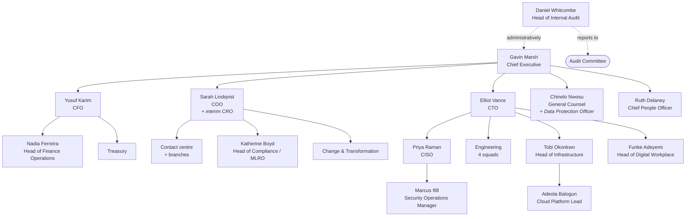

# FinServe Digital Bank Ltd — Organisation

**Classification:** Internal · **Owner:** Chief People Officer
**Effective:** W1 D1

---

## 1. Board

| Role | Name | Notes |
|---|---|---|
| Chair | Margaret Fenwick | Independent. Former building society CEO |
| Chief Executive | Gavin Marsh | Founder. Executive director |
| Chief Financial Officer | Yusuf Karim | Executive director |
| Chief Operating Officer | Sarah Lindqvist | Executive director. **Also interim Chief Risk Officer** |
| NED, Chair of Audit Committee | Helen Osei | Thirty years financial services audit |
| NED, Chair of Risk Committee | Raymond Tse | Previously at a bank subject to enforcement action |
| NED | Dr Anita Krishnan | Technology background |
| NED | Charles Oyelaran | Commercial, investor-nominated |

The Chief Technology Officer and the Chief Information Security Officer are
not board members. The CTO attends board meetings by standing invitation. The
CISO attends the Risk Committee twice a year and has attended the board once,
in 2023, following the PRA letter.

### Committees

| Committee | Chair | Frequency | Attendees |
|---|---|---|---|
| Audit | Helen Osei | Quarterly | CFO, Head of Internal Audit, external auditor |
| Risk | Raymond Tse | Quarterly | COO/interim CRO, CFO, Head of Compliance, CISO (×2/yr) |
| Remuneration | Charles Oyelaran | Twice yearly | — |
| Executive Committee | Gavin Marsh | Weekly | All executives |

The Chief Risk Officer post has been **vacant since May 2025**. The COO is
covering it on an interim basis alongside her own role. Recruitment was paused
in July pending the funding round.

## 2. Executive structure

## 3. Headcount

| Function | FTE | Location |
|---|---|---|
| Engineering | 118 | HQ + remote |
| Contact centre | 96 | HQ |
| Operations and branches | 74 | HQ, MAN, BIR, LEE |
| Finance | 31 | HQ |
| Infrastructure and platform | 24 | HQ + remote |
| Product and design | 22 | HQ |
| Marketing and growth | 19 | HQ |
| Risk and compliance | 14 | HQ |
| People | 11 | HQ |
| Legal | 7 | HQ |
| Digital workplace | 6 | HQ |
| **Security** | **3** | HQ |
| Internal audit | 2 | HQ |
| Executive | 5 | HQ |
| **Total FTE** | **431** | |

## 4. The security function

Three people, for 450 staff and 180,000 customers.

| Role | Name | Scope |
|---|---|---|
| CISO | Priya Raman | Strategy, policy, risk, regulatory engagement, board reporting |
| Security Operations Manager | Marcus Ifill | Monitoring, detection, incident response, vulnerability management |
| Security Analyst | Joel Amankwah | Joined September 2025. Second line of the two-person rota |

There is no security architecture role, no detection engineering role, no GRC
analyst inside the security function, and no out-of-hours rota. Alerts outside
working hours page Marcus Ifill's mobile.

Recruitment for a fourth role — security engineer — was approved in the FY2026
budget and has not been opened.

## 5. Control functions

| Function | Head | Reports to | Headcount |
|---|---|---|---|
| Risk | *Vacant* (COO interim) | CEO | 6 |
| Compliance / MLRO | Katherine Boyd | COO | 8 |
| Internal Audit | Daniel Whitcombe | Audit Committee | 2 + co-source |
| Legal / Data Protection | Chinelo Nwosu | CEO | 7 |
| Security | Priya Raman | **CTO** | 3 |

Internal audit is co-sourced with a mid-tier firm for specialist work,
including IT audit. The 2024 IT audit was performed by the co-source partner.

## 6. Recent and pending changes

- **CRO vacancy** since May 2025, covered by the COO. Recruitment paused July.
- **Head of Infrastructure** — Tobi Okonkwo has resigned and leaves in eight
  weeks. Successor not appointed. He holds the deepest knowledge of the Slough
  estate and the Kestrel-era processes, and is named as the key-person
  dependency in risk R-11.
- **Security engineer** role budgeted, not opened.
- **Contact centre** grew by 40 FTE during 2025 to meet app-volume growth.
- A **restructure of the change function** is under discussion for Q2.

## 7. Working patterns

Hybrid. Most staff are in the office two days a week; engineering is largely
remote with quarterly on-sites. Around 120 people are connected remotely at any
time during working hours.

BYOD is permitted for email and Teams across the organisation. Corporate
devices are issued to engineering, infrastructure, finance, risk, compliance,
legal and security. Contact centre staff use shared corporate desktops on
site; branch staff use corporate laptops.
