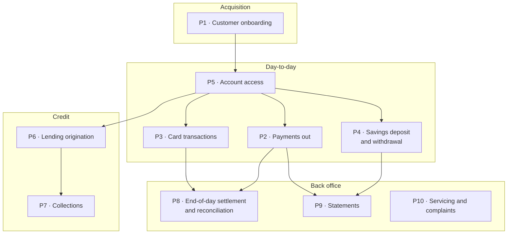
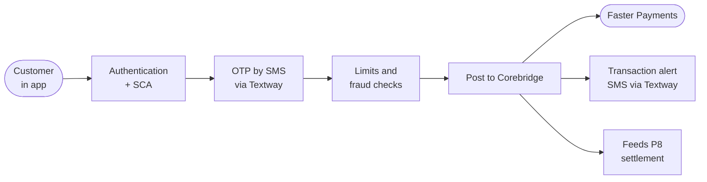
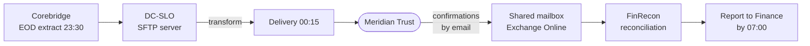

# FinServe Digital Bank Ltd — Business Processes

**Classification:** Internal · **Owner:** Chief Operating Officer
**Last reviewed:** 2025-03 (with the operational resilience self-assessment)

---

## 1. Process map

## 2. P1 — Customer onboarding

App-only. Target completion under ten minutes.

| Step | System | Third party |
|---|---|---|
| Application capture | Onboarding service (AKS) | — |
| Identity verification | Onboarding service | IDVerify — document and biometric check |
| Sanctions and PEP screening | Corebridge | Corebridge screening module |
| Customer due diligence decision | Onboarding service; manual referral for exceptions | — |
| Account creation | Corebridge | — |
| Card issue | Corebridge | Card bureau via Corebridge |

Around 2,400 applications a week. 71% complete straight through; 22% are
referred for manual review by the onboarding operations team (9 FTE); 7% are
declined or abandoned.

Documents captured at this step — passport or driving licence images, and the
National Insurance number — are retained for the life of the relationship plus
the retention period. This is data category D2.

## 3. P2 — Payments out

The highest-volume customer-facing process. ~48,000 initiations a day.

Strong Customer Authentication under the PSRs 2017 is satisfied by the app
possession factor plus a one-time passcode delivered by SMS. **The OTP path
depends on a single third party, Textway, with no configured fallback.** A
Textway outage stops new payment initiation.

Limits: £10,000 per transaction, £25,000 daily, lower for the first 30 days of
a relationship.

## 4. P8 — End-of-day settlement and reconciliation

The oldest process in the bank, inherited from Kestrel and largely unchanged
since 2019.

Owned by Finance Operations (Nadia Ferreira, 6 FTE). Runs unattended. If the
delivery fails, the failure is discovered when the reconciliation report does
not arrive at 07:00, or when Meridian Trust telephone.

There is a documented manual fallback: Finance Operations can produce and
deliver the file by hand. It takes approximately four hours and has been used
twice, most recently in 2024.

**This process is not on the list of important business services in §5.**
The 2025 self-assessment treated it as a back-office function on the basis that
it is not customer-facing.

## 5. Important business services and impact tolerances

From the operational resilience self-assessment approved by the board in March
2025.

| # | Important business service | Impact tolerance | Primary dependencies | Tested |
|---|---|---|---|---|
| IBS-1 | Making payments | 4 hours | Corebridge, Azure prod, Textway (SCA), Faster Payments | **Yes** — Nov 2024 |
| IBS-2 | Access to accounts and balances | 2 hours | Azure prod, Corebridge, Front Door | **Yes** — Nov 2024 |
| IBS-3 | Card payments | 2 hours | Corebridge, card scheme | No — dependency on Corebridge testing |
| IBS-4 | Opening an account | 24 hours | Onboarding service, IDVerify, Corebridge | No |
| IBS-5 | Savings deposit and withdrawal | 4 hours | Corebridge, Azure prod | No |

Two of five tested. The November 2024 exercise covered the database tier of the
Azure estate; the application-tier failover was walked through on paper.

Mapping of each service to the people, processes, technology, facilities and
third parties it depends on exists at one level of decomposition. It has not
been extended to fourth parties — the self-assessment records this as a known
limitation with no date attached.

## 6. Process ownership

| Process | Owner | Function |
|---|---|---|
| P1 Onboarding | Sarah Lindqvist (COO) | Operations |
| P2 Payments out | Sarah Lindqvist (COO) | Operations |
| P3 Card transactions | Sarah Lindqvist (COO) | Operations |
| P4 Savings | Yusuf Karim (CFO) | Finance |
| P5 Account access | Elliot Vance (CTO) | Technology |
| P6 Lending origination | Yusuf Karim (CFO) | Finance |
| P7 Collections | Yusuf Karim (CFO) | Finance |
| P8 Settlement and reconciliation | Nadia Ferreira | Finance Operations |
| P9 Statements | Nadia Ferreira | Finance Operations |
| P10 Servicing and complaints | Sarah Lindqvist (COO) | Operations |

P8 is the only process whose owner is below executive level.

## 7. Volumes

| Measure | Value |
|---|---|
| Payment initiations | ~48,000/day |
| Card authorisations | ~112,000/day |
| SMS messages sent (OTP + alerts) | ~62,000/day |
| App sessions | ~240,000/day |
| Onboarding applications | ~2,400/week |
| Contact centre contacts | ~3,100/week |
| Complaints | ~180/month |
| Production changes | ~140/month |

## 8. Known process debt

Maintained by the Change function:

- P8 runs on Kestrel-era tooling with a single named owner and a four-hour
  manual fallback
- P1 manual referral rate of 22% against a business case that assumed 10%
- No fallback path for SMS delivery in P2
- Complaints handling is spreadsheet-based pending a system selection
- Fourth-party mapping not started
- Three of five important business services untested
