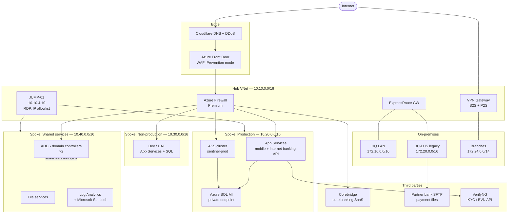

# FinServe — Network Architecture

**Classification:** Internal · **Owner:** Head of Infrastructure (T. Okonkwo)
**Last reviewed:** 2025-11-14 · **Next review:** annual

FinServe operates a hybrid estate. The majority of customer-facing workload
runs in Azure; a diminishing legacy footprint remains in a co-located data
centre in Lagos that we have been decommissioning since the 2023 migration
programme.

---

## 1. Sites

| Site | Location | Users | Connectivity |
|---|---|---|---|
| HQ | Victoria Island, Lagos | 310 | 2 × 500 Mbps fibre (diverse carriers), ExpressRoute 1 Gbps |
| DC-LOS | Ikeja co-location, Lagos | — | 1 Gbps to HQ, ExpressRoute 500 Mbps |
| BR-ABJ | Abuja branch | 55 | 200 Mbps fibre + LTE failover, S2S VPN |
| BR-PHC | Port Harcourt branch | 48 | 200 Mbps fibre + LTE failover, S2S VPN |
| BR-KAN | Kano branch | 37 | 100 Mbps fibre, S2S VPN |
| Remote | Home / field | ~120 concurrent | Azure VPN Gateway (P2S) |

Branches reach Azure over site-to-site VPN terminating on the hub VPN gateway.
Only HQ and DC-LOS have ExpressRoute.

## 2. Topology

## 3. Segmentation

Spokes peer to the hub, not to each other. Inter-spoke traffic is forced
through Azure Firewall by user-defined routes.

| Path | Control | Notes |
|---|---|---|
| Internet → public apps | Front Door + WAF, then Azure Firewall | WAF in Prevention mode since Mar 2025 |
| Prod ↔ Non-prod | Azure Firewall, default deny | Two documented exceptions, see 3.1 |
| Spoke → on-prem | ExpressRoute or S2S VPN, firewall rules | |
| Branch → Azure | S2S VPN | Branch LANs are flat; no VLAN segmentation below site level |
| Admin → anything | via JUMP-01 | |
| Prod → Corebridge | S2S IPsec to Corebridge edge | |

### 3.1 Standing firewall exceptions

Two exceptions to prod/non-prod separation are recorded in the change
management system:

- **CHG-2024-0881** — UAT App Service may reach `sqlmi-prod` on 1433 for the
  nightly data refresh. Raised for the Corebridge migration, approved by the
  CTO, no expiry date set.
- **CHG-2025-0132** — Dev subnet may reach the shared-services file server for
  build artefacts.

## 4. Remote and administrative access

Staff remote access is Azure VPN Gateway point-to-site, Entra ID
authentication, MFA required.

Administrative access to production goes through **JUMP-01**, a Windows Server
2022 host in the hub. RDP (3389) to JUMP-01 is permitted from the HQ egress
addresses and from four named home addresses belonging to the infrastructure
team. Azure Bastion was evaluated in 2024 and deferred on cost grounds; the
allowlist was accepted as an equivalent control.

Branch staff do not have administrative access to anything in Azure.

## 5. Egress

Outbound traffic from Azure spokes egresses through Azure Firewall with
application rules permitting Microsoft services, package repositories
(`*.nuget.org`, `*.npmjs.org`, `*.pypi.org`), and a named list of partner
endpoints. On-premises egress from HQ and DC-LOS goes through a pair of
Fortigate firewalls with outbound web filtering.

Branch sites egress locally to the internet for general browsing and tunnel
only corporate-destined traffic over the S2S VPN (split tunnelling), to
conserve branch bandwidth.

## 6. Logging and telemetry

| Source | Destination | Retention | Onboarded |
|---|---|---|---|
| Azure Firewall (all rules) | Log Analytics `law-sentinel-prod` | 60 days | Yes |
| Azure Front Door / WAF | Log Analytics | 60 days | Yes |
| AKS control plane + container logs | Log Analytics | 30 days | Yes |
| App Service HTTP logs | Log Analytics | 60 days | Yes |
| Azure SQL MI audit | Storage account, immutable | 1 year | Partial — audit on, Sentinel connector not configured |
| VPN Gateway (P2S + S2S) | Log Analytics | 60 days | Yes |
| JUMP-01 security event log | Log Analytics via AMA | 60 days | Yes |
| Domain controllers | Log Analytics via AMA | 60 days | Yes |
| Fortigate (HQ, DC-LOS) | Syslog → Log Analytics | 60 days | Yes |
| **Branch firewalls** | Local only | 14 days on device | **No** |
| **DC-LOS SFTP server** | Local syslog | 30 days on device | **No** |
| Corebridge application logs | Held by Corebridge | Per contract | No — accessible by ticket |

Microsoft Sentinel is the SIEM. Analytics rules in production are the Microsoft
built-in templates for Entra ID, Azure Activity and Azure Firewall, plus four
custom KQL rules written during the 2024 deployment. There is no formal
detection engineering backlog.

Log Analytics workspace retention is set to 60 days across the board. Extending
retention was priced during the 2025 budget round and deferred.

## 7. Regulatory context

CBN's *Risk-Based Cybersecurity Framework and Guidelines for Deposit Money
Banks and Payment Service Providers* applies. Relevant to this document:
network segmentation between environments, controlled and logged
administrative access, and retention of security event logs sufficient to
support incident investigation.

## 8. Known architecture debt

Tracked in the infrastructure backlog, not yet scheduled:

- DC-LOS decommission — 11 workloads remain, target end-2026
- Branch LAN segmentation — no VLANs below site level
- Replacement of JUMP-01 with Azure Bastion — deferred 2024, not re-priced
- IPv6 — not implemented anywhere
