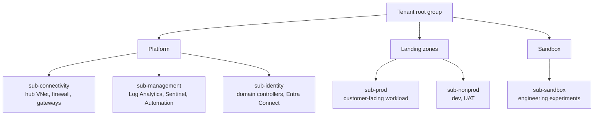
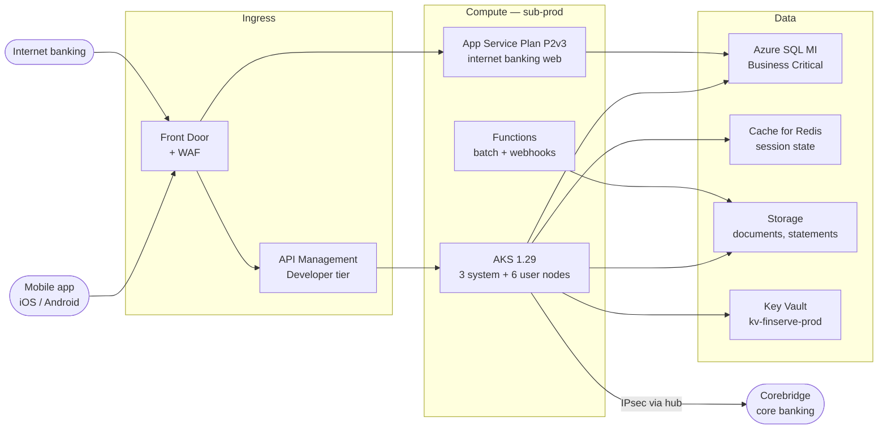

# FinServe — Azure Architecture

**Classification:** Internal · **Owner:** Cloud Platform Lead (A. Balogun)
**Last reviewed:** 2025-09-30 · **Next review:** annual

FinServe's Azure estate was built during the 2023–2024 migration programme
("Project Lighthouse") to a hub-and-spoke landing zone pattern. Tenant region
is `uksouth` with `ukwest` as paired region.

---

## 1. Tenant and subscriptions

Single Entra ID tenant: `finservedigital.onmicrosoft.com`, vanity domain
`finserve.example`.

| Subscription | Purpose | Azure Policy | Defender for Cloud |
|---|---|---|---|
| `sub-connectivity` | Hub networking | Platform initiative | Standard |
| `sub-management` | Logging, SIEM, automation | Platform initiative | Standard |
| `sub-identity` | ADDS, Entra Connect | Platform initiative | Standard |
| `sub-prod` | Production workload | Landing-zone initiative | Standard |
| `sub-nonprod` | Dev and UAT | Landing-zone initiative (audit-only effects) | Free tier |
| `sub-sandbox` | Engineering experiments | None assigned | Free tier |

`sub-sandbox` was created for the platform team to trial services without
change control. It is excluded from the landing-zone policy initiative by
design — the team's position is that policy-blocked experiments defeat the
purpose of a sandbox.

## 2. Production workload

**Microservices on AKS.** Eleven services: accounts, payments, cards,
notifications, statements, onboarding, limits, disputes, audit-log, fx, and an
API gateway shim. Workload identity is enabled for six of the eleven; the
remaining five authenticate to Azure SQL with connection strings supplied as
Kubernetes secrets.

**Ingress.** Front Door terminates TLS, WAF runs the Microsoft default rule set
in Prevention mode. API Management sits in front of AKS for the mobile API and
enforces subscription keys and rate limits. The internet banking web front end
bypasses APIM and goes to App Service directly — a Lighthouse-era decision that
was never revisited.

## 3. Data services

| Service | Data | Encryption | Backup |
|---|---|---|---|
| Azure SQL MI `sqlmi-prod` | Customer, account, transaction metadata | TDE, service-managed key | Automated, 35-day PITR, weekly LTR to `ukwest` |
| Storage `stfinservedocs` | Statements, uploaded KYC documents | SSE, Microsoft-managed key | GRS, soft delete 30 days |
| Cache for Redis | Session tokens | In-transit TLS | None — ephemeral by design |
| Key Vault `kv-finserve-prod` | Certificates, API keys, some connection strings | HSM-backed (Premium) | Soft delete + purge protection on |
| Azure SQL `sqldb-uat` | UAT data — refreshed nightly from production | TDE | 7-day PITR |

The nightly UAT refresh copies the production database and applies a masking
script to customer names and email addresses. Account numbers, balances,
transaction history and National Insurance numbers are copied unmasked, because the UAT test
pack depends on referential consistency with production for reconciliation
testing.

## 4. Identity and access to Azure

RBAC is assigned to Entra ID groups, not individuals. Group membership is
managed by the platform team via ticket.

| Role | Scope | Members | Assignment |
|---|---|---|---|
| Owner | Tenant root | 3 | Permanent |
| Owner | `sub-prod` | 2 | Permanent |
| Contributor | `sub-prod` | 9 (platform + senior devs) | Permanent |
| Contributor | `sub-nonprod` | 21 | Permanent |
| Owner | `sub-sandbox` | 14 (whole platform + dev team) | Permanent |
| Reader | All landing zones | 31 | Permanent |

Entra ID Privileged Identity Management is licensed under the P2 entitlement
but has not been configured; role assignments are standing rather than
just-in-time. A PIM rollout was on the 2025 roadmap and slipped to 2026 when
the Corebridge migration took priority.

Break-glass: two cloud-only accounts hold permanent Global Administrator,
excluded from Conditional Access policies including the MFA requirement, with
credentials in a sealed envelope in the HQ safe. This follows the documented
Microsoft pattern. Sign-in alerting on these accounts is configured in Sentinel.

## 5. Infrastructure as code and deployment

Terraform, state in `stfinservetfstate` (`sub-management`), locked via blob
lease. Repositories in Azure DevOps; pipelines deploy to non-prod on merge and
to prod on manual approval by a platform team member.

The service connection used by the production pipeline holds Contributor on
`sub-prod` and is a workload identity federation credential. Two older
pipelines still use a service principal with a client secret; the secret was
last rotated in March 2024 and has a two-year expiry.

Not all infrastructure is in Terraform. Resources created during incident
response or the initial migration — roughly 15% of the estate by resource count
— exist only in the portal and are reconciled manually at quarterly review.

## 6. Resilience

- **RTO** 4 hours, **RPO** 15 minutes for customer-facing services
- SQL MI Business Critical with a secondary replica in `ukwest`
- AKS is single-region; a second cluster in `ukwest` is deployed but scaled
  to zero and is brought up manually
- Front Door provides failover between regional origins

Failover has been tested once, in the November 2024 DR exercise, for the
database tier only. The AKS failover path has been walked through on paper but
not executed. A restore from LTR backup to a clean subscription has not been
performed.

## 7. Logging and telemetry

All platform and landing-zone subscriptions send Activity Log, resource
diagnostic settings and Defender for Cloud alerts to `law-sentinel-prod` in
`sub-management`. Retention 60 days, as noted in the network document.

`sub-sandbox` sends Activity Log only. Resource-level diagnostics are not
enforced there because no policy initiative is assigned.

Sentinel data connectors enabled: Azure Activity, Entra ID (sign-in and audit),
Microsoft 365, Defender for Cloud, Azure Firewall, Azure WAF, Threat
Intelligence (Microsoft feed). Not enabled: Azure SQL audit, Storage
diagnostics, AKS audit log.

## 8. Regulatory context

**PRA SS2/21 — Outsourcing and third party risk management** treats this cloud
estate as material outsourcing. It requires a written agreement, documented due
diligence, a register of material arrangements, defined exit and substitution
options, and rights of access and audit for both the firm and the regulators.

**FCA PS21/3 / PRA SS1/21 — Operational resilience** requires the important
business services running on this estate to be mapped and their impact
tolerances tested. The untested AKS failover path in §6 is directly in scope.

The tenant's primary and paired regions are both in the UK, so this layer
raises no Chapter V transfer question on its own; the transfers that do occur
are in [04-Data-Flow.md](04-Data-Flow.md) §5.

## 9. Cost and scale

| Metric | Value |
|---|---|
| Monthly Azure spend | ~£ 38k |
| Resource count | ~1,180 |
| Peak transactions/second | 340 |
| AKS node count (prod) | 9 |
| Largest single line item | SQL MI Business Critical, ~31% |
