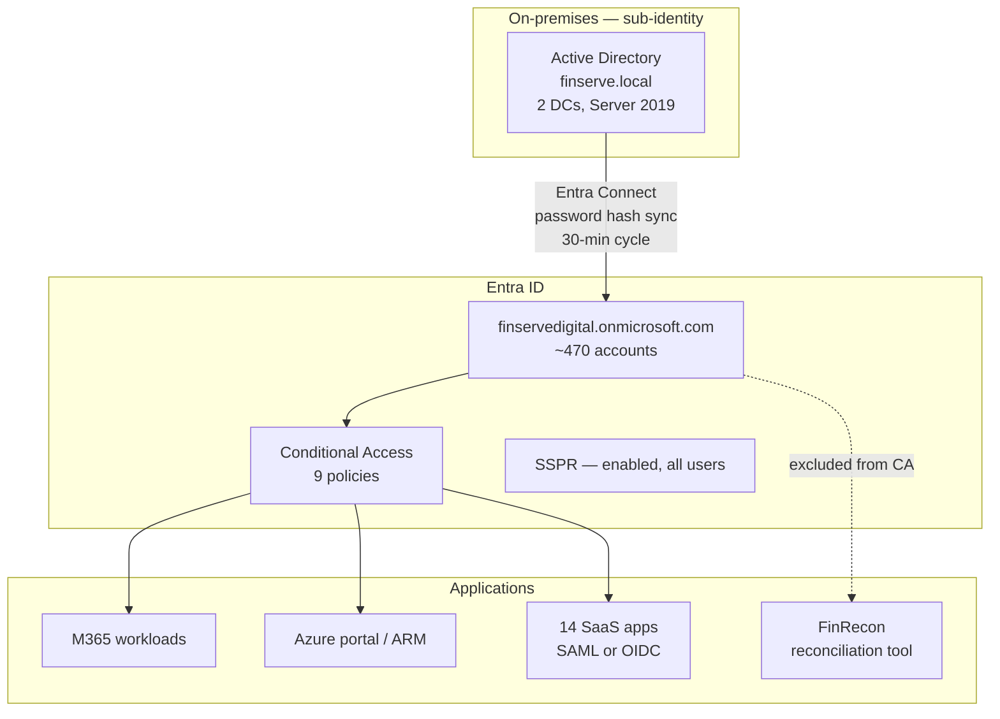

# FinServe — Microsoft 365 Architecture

**Classification:** Internal · **Owner:** Head of Digital Workplace (F. Adeyemi)
**Last reviewed:** 2025-08-22 · **Next review:** annual

Single tenant `finservedigital.onmicrosoft.com`, shared with the Azure estate.
Primary SMTP domain `finserve.ng`. Migrated from on-premises Exchange 2016 in
2023; the last mailbox moved in October 2023.

---

## 1. Licensing

| SKU | Seats | Assigned to |
|---|---|---|
| Microsoft 365 E5 | 120 | Executive, IT, risk, compliance, finance |
| Microsoft 365 E3 | 290 | General staff |
| Microsoft 365 F3 | 40 | Branch tellers, contact centre |
| Entra ID P2 | 120 | Bundled with E5 |
| Defender for Office 365 Plan 2 | 120 | Bundled with E5 |
| Intune | 450 | All staff |

E5 security features are therefore available to 120 of 450 users. Defender for
Office 365 Plan 1 protections (Safe Links, Safe Attachments) are licensed for
E3 users through an add-on purchased in 2024; Plan 2 features — automated
investigation and response, attack simulation, threat explorer — apply only to
the E5 cohort.

## 2. Identity

**Hybrid identity.** Active Directory `finserve.local` remains authoritative
for user objects. Entra Connect runs on a dedicated server in `sub-identity`
with password hash synchronisation. Seamless SSO is enabled. There is no
tiered administrative model in AD; Domain Admins is a single group with 6
members, all of whom also hold day-to-day workstation accounts.

**Conditional Access.** Nine policies:

| # | Policy | Applies to | Grant |
|---|---|---|---|
| 1 | Require MFA for all users | All users | MFA |
| 2 | Require MFA for admins | 8 directory roles | MFA, sign-in frequency 4h |
| 3 | Block legacy authentication | All users | Block |
| 4 | Require compliant device — Azure management | All users | Compliant device |
| 5 | Block access from outside Nigeria, UK, UAE | All users | Block |
| 6 | Require MFA for guests | Guests | MFA |
| 7 | Session controls for unmanaged devices | All users | App-enforced restrictions |
| 8 | Require terms of use | New starters | ToU |
| 9 | High sign-in risk — require password change | All users | Password change |

Policies 1, 3 and 5 carry an exclusion group, `CA-Exclusions-Service`,
containing the two break-glass accounts, three service accounts, and the
shared mailbox used by the FinRecon reconciliation tool. FinRecon is a
third-party desktop application that authenticates to Exchange Online using
basic authentication over IMAP to read payment confirmation emails. The vendor
has committed to OAuth support "in a future release"; the exclusion was granted
in 2023 under change CHG-2023-0447 with a 12-month review that has been renewed
twice.

## 3. Exchange Online

- 470 user mailboxes, 38 shared mailboxes, 12 resource mailboxes
- Inbound mail: Exchange Online Protection, no third-party gateway
- SPF, DKIM and DMARC published for `finserve.ng`; DMARC policy is `p=none`
- External sender warning banner enabled tenant-wide
- Mailbox audit logging on by default
- Auto-forwarding to external domains blocked by outbound spam policy

Anti-phishing: Defender for Office 365 anti-phishing policy applies mailbox
intelligence and impersonation protection to 22 protected users (board and
executive) and 3 protected domains. Users outside that list receive the
standard EOP anti-phishing policy.

Safe Attachments is in **Dynamic Delivery**; Safe Links is enabled for email
and Teams, with "Do not rewrite the following URLs" carrying 14 entries added
over time, including two partner domains and the corporate intranet.

## 4. SharePoint, OneDrive and Teams

| Setting | Value |
|---|---|
| External sharing — SharePoint | New and existing guests |
| External sharing — OneDrive | Existing guests only |
| Default sharing link | People in your organisation |
| Anonymous ("Anyone") links | Permitted on 3 sites, expiry 30 days |
| Guest accounts | 61 active |
| Teams — guest access | Enabled |
| Teams — external federation | Open to all domains |
| Unmanaged device access | Limited, web-only (CA policy 7) |

Roughly 240 Teams exist. Team creation is restricted to a `Teams-Creators`
group of 34 people. There is no naming policy and no expiry policy; the
2024 governance review recommended both and neither has been implemented.

Sensitivity labels are published — `Public`, `Internal`, `Confidential`,
`Restricted` — with encryption applied by the `Restricted` label only. Label
application is voluntary; no auto-labelling policies are active. Adoption
measured in the June 2025 review was 18% of documents in scope.

## 5. Data loss prevention and retention

Three DLP policies are enabled:

1. **Nigerian BVN and NIN** — blocks sharing outside the organisation, applies
   to Exchange, SharePoint, OneDrive and Teams. Notification to user, incident
   report to `dlp-alerts@finserve.ng`.
2. **Payment card numbers** — blocks external sharing, Exchange and SharePoint.
3. **Credentials in email** — tip only, no block.

DLP does not extend to Endpoint (Endpoint DLP is not enabled) or to the
`Restricted`-labelled content stored in the document storage account outside
M365.

Retention: a single tenant-wide policy retains all Exchange, SharePoint and
OneDrive content for 7 years, aligned to the CBN record-keeping expectation.
There is no disposition review and no separate retention for Teams chat, which
falls under the same 7-year rule.

## 6. Endpoint

| Platform | Count | Management | Compliance policy |
|---|---|---|---|
| Windows 11 corporate laptops | 355 | Intune, Entra joined | Enforced |
| macOS | 22 | Intune | Enforced |
| iOS / Android corporate | 95 | Intune, supervised | Enforced |
| iOS / Android BYOD | ~210 | Intune app protection policies | **Report-only** |

Corporate Windows devices run Defender for Endpoint (onboarded via Intune),
BitLocker with keys escrowed to Entra ID, and Attack Surface Reduction rules in
Block mode for 9 of the 16 available rules. The remaining 7 are in Audit mode
pending an application compatibility assessment started in early 2025.

BYOD is handled with App Protection Policies rather than full enrolment. The
device compliance policy that would gate BYOD access was deployed in
**report-only** mode in February 2025 to assess impact before enforcement, and
has remained in report-only since.

## 7. Logging and telemetry

| Source | Destination | Retention |
|---|---|---|
| Entra ID sign-in logs | Sentinel (connector) + Entra | 60 days Sentinel, 30 days Entra |
| Entra ID audit logs | Sentinel (connector) | 60 days |
| Unified Audit Log | Purview | 180 days (E5), 90 days (E3/F3) |
| Defender for Office 365 alerts | Sentinel (M365 Defender connector) | 60 days |
| Defender for Endpoint | Defender portal + Sentinel | 30 days raw, 180 days alerts |
| Intune audit | Intune only, not forwarded | 1 year |
| DLP incidents | Purview + email to dlp-alerts | 180 days |

Unified Audit Log retention differs by licence, so audit history for the 330
E3/F3 users is 90 days against the E5 cohort's 180.

## 8. Regulatory context

CBN guidelines and the NDPA 2023 both bear on this layer. NDPA obligations
attach to the personal data in mailboxes, SharePoint and the KYC document
store — lawful basis, data subject rights including access and erasure, and
breach notification to the NDPC within 72 hours of becoming aware.

The 7-year retention policy and the NDPA storage limitation principle are in
tension for categories of personal data with no statutory retention
requirement. A data retention schedule mapping category to period was drafted
by the compliance team in 2024 and has not been signed off.

## 9. Known debt

- FinRecon basic authentication exclusion — renewed twice, vendor OAuth pending
- BYOD compliance policy in report-only since February 2025
- No Teams naming or expiry policy
- Sensitivity label adoption at 18%
- DMARC at `p=none`
- Retention schedule unsigned
- Seven ASR rules in Audit mode
