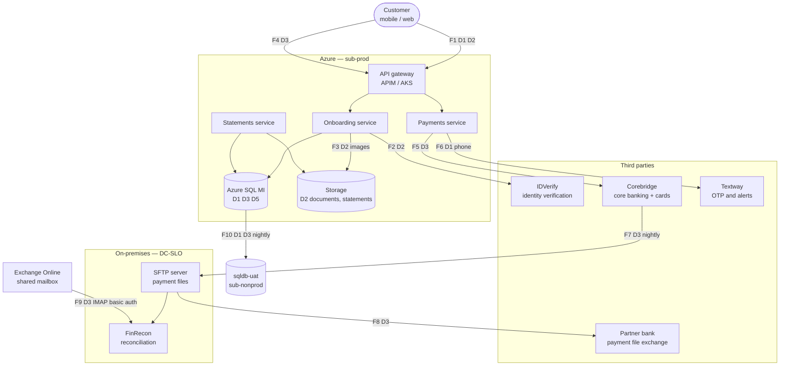

# FinServe — Data Flow

**Classification:** Internal · **Owner:** Data Protection Officer (C. Nwosu)
**Last reviewed:** 2025-07-08 · **Next review:** annual

Where customer data originates, where it moves, who else touches it and under
what basis. This document is the reference for the record of processing
activities and for any data protection impact assessment.

---

## 1. Data categories

| # | Category | Examples | Sensitivity | Volume |
|---|---|---|---|---|
| D1 | Identity | Name, DOB, address, phone, email | Confidential | ~180,000 subjects |
| D2 | Identity documents | National Insurance number, passport / driving licence images | **Restricted** | ~180,000 |
| D3 | Financial | Account number, balance, transaction history | **Restricted** | ~215,000 accounts |
| D4 | Card | PAN, expiry, tokenised credentials | **Restricted** (PCI scope) | ~94,000 cards |
| D5 | Behavioural | Device ID, IP, session, app telemetry | Internal | continuous |
| D6 | Employee | HR records, payroll, performance | Confidential | 450 |
| D7 | Credentials | Password hashes, tokens, API keys | **Restricted** | — |

Card data (D4) is the narrowest scope: FinServe does not store PANs. Card
issuing and processing is performed by Corebridge, and the mobile app displays
tokenised references only. The PCI DSS SAQ completed in 2025 was scoped on that
basis.

## 2. Principal flows



| Flow | Description | Data | Transport | Frequency |
|---|---|---|---|---|
| F1 | Customer submits onboarding | D1, D2 | TLS 1.2+ | On demand |
| F2 | Electronic ID&V check | D2 | HTTPS, mutual TLS, API key | Per onboarding |
| F3 | ID document upload | D2 | TLS, stored SSE | Per onboarding |
| F4 | Transfer initiation | D3 | TLS 1.2+ | ~48k/day |
| F5 | Core banking posting | D3 | IPsec S2S, REST | Real time |
| F6 | OTP / transaction alert | D1 (phone), D3 (amount) | HTTPS to SMS aggregator | ~62k/day |
| F7 | End-of-day settlement extract | D3 | Corebridge → SFTP, SSH | Nightly 23:30 |
| F8 | Partner bank file delivery | D3 | SFTP | Nightly 00:15 |
| F9 | Reconciliation confirmations | D3 | IMAP basic auth (see §4) | Nightly |
| F10 | UAT data refresh | D1, D3 | Internal, within Azure | Nightly 02:00 |

## 3. Third parties

| Party | Service | Data received | Location | Contract | DPA |
|---|---|---|---|---|---|
| Corebridge Technologies Ltd | Core banking, card processing | D1, D3, D4 | Leeds + Dublin DR | MSA 2021, renewed 2024 | Yes |
| IDVerify UK Ltd | Electronic ID&V | D2 | London | SaaS agreement 2023 | Yes |
| Textway Communications | SMS delivery | D1 (phone), D3 (amount in message body) | London; routes via a Singapore aggregator | Reseller terms | **No — standard T&Cs only** |
| Partner bank (Meridian Trust) | Settlement file exchange | D3 | London | Interbank agreement 2019 | Pre-dates UK GDPR |
| Microsoft | Azure, M365 | All categories | `uksouth` / `ukwest` | Microsoft Product Terms + DPA | Yes |
| FinRecon (Solvex Systems) | Reconciliation desktop tool | D3 | On-premises; vendor support access from Bengaluru | Licence 2023 | No |

Supplier due diligence was performed on Corebridge and IDVerify at
procurement. Textway was onboarded by the marketing team in 2022 for campaign
messaging and later extended to transactional OTP delivery without a
re-assessment.

## 4. The reconciliation path

The nightly settlement cycle is the oldest flow in the estate and the least
changed since the on-premises era.

Corebridge writes an end-of-day extract to the DC-SLO SFTP server at 23:30.
A scheduled task on that server transforms the file and delivers it to Meridian
Trust at 00:15. FinRecon then reads confirmation emails from a shared mailbox
and produces the reconciliation report circulated to finance by 07:00.

The delivery script authenticates to Meridian Trust with a static credential.
An extract from the scheduled task's configuration:

```ini
; deliver.cfg — DC-SLO settlement delivery
[target]
host     = sftp.meridiantrust.example
port     = 22
user     = finserve_settle
password = Settl3m3nt!Feb2019                  ; SIM-FAKE scenario-02
key_file =                                     ; unused
```

The credential has not been rotated since the arrangement began. Meridian
Trust's own security review in 2024 recommended key-based authentication;
FinServe's response, recorded in the supplier file, was that the change would
require Solvex to modify FinRecon and that it would be scheduled alongside the
DC-SLO decommission.

## 5. Cross-border transfer

The Azure tenant's primary region is `uksouth` with `ukwest` as paired region,
so the M365 and Azure processing of categories D1–D5 is domestic and raises no
Chapter V transfer question.

Three flows do leave the UK:

| Flow | Destination | Position |
|---|---|---|
| Corebridge DR site | Dublin, Ireland | Covered by the UK adequacy regulations for the EEA. Microsoft DPA and the Corebridge MSA both contain UK GDPR processor terms. |
| Textway SMS routing | Singapore aggregator | No adequacy regulations. No IDTA and no UK Addendum in place. Identified in the 2025 data mapping exercise; not yet assessed. |
| FinRecon vendor support | Bengaluru, India | Remote support sessions give Solvex engineers sight of D3 during troubleshooting. The 2024 India adequacy regulations do not extend to transfers to Indian entities acting as processors for financial data of this kind; no IDTA is in place. |

The 2024 legal opinion covered the Microsoft arrangement only. It did not
consider the Textway or Solvex paths, both of which post-date it in their
current form.

## 6. Retention

| Category | Retention | Basis |
|---|---|---|
| D1, D3 — account records | 7 years after closure | Policy; MLR 2017 requires 5 |
| D2 — KYC documents | 7 years after closure | Policy; MLR 2017 requires 5 |
| D4 — card | Held by Corebridge, per their schedule | Contract |
| D5 — behavioural | 7 years (falls under tenant-wide M365 policy where in scope; indefinite in SQL) | None identified |
| D6 — employee | 6 years after leaving | Employment practice |
| D7 — credentials | Life of account | — |

D5 behavioural data in Azure SQL has no deletion routine. The table
`dbo.SessionTelemetry` holds rows from the 2023 launch onward.

## 7. Data subject rights

Access, rectification and erasure requests arrive via
`dpo@finserve.co.uk` and are handled manually by the DPO with support from the
platform team. There is no automated discovery across systems; fulfilment
involves queries against Azure SQL, a search in Purview for M365 content, and a
ticket to Corebridge.

Mean time to fulfil an access request in 2025 was 24 days against the UK
GDPR's one-month deadline. Six requests were received in the year.

Erasure is complicated by the 7-year retention policy: the documented
position is that erasure requests from customers with a closed account inside
the retention window are refused with an explanation, and the record is
flagged rather than deleted.

## 8. Regulatory context

- **UK GDPR and Data Protection Act 2018** — lawful basis, data subject rights,
  Chapter V transfers, breach notification to the ICO within 72 hours,
  DPO appointment
- **Money Laundering Regulations 2017** — customer due diligence and a
  **5-year** record retention requirement from the end of the relationship
- **PRA SS2/21 — Outsourcing and third party risk management** — material
  outsourcing register, due diligence, exit planning
- **FCA PS21/3 / PRA SS1/21 — Operational resilience** — important business
  services, impact tolerances, mapping of third-party dependencies
- **Payment Services Regulations 2017** — Strong Customer Authentication on
  the payment initiation flow (F4/F6)
- **PCI DSS v4.0** — SAQ-scoped; FinServe does not store PAN

## 9. Known gaps

Recorded in the data protection working file:

- Textway has no DPA and no completed supplier assessment
- Meridian Trust interbank agreement pre-dates UK GDPR and has no processor clauses
- Retention schedule drafted 2024, unsigned; policy retains 7 years where
  MLR 2017 requires 5, with no identified basis for the extra 2
- No deletion routine for D5 behavioural data
- No IDTA or UK Addendum for the Textway (Singapore) or Solvex (India) paths
- The 2024 legal opinion covers Microsoft only
- DSAR fulfilment manual, mean 24 days against a 30-day obligation
- Material outsourcing register under SS2/21 not reconciled against this table
